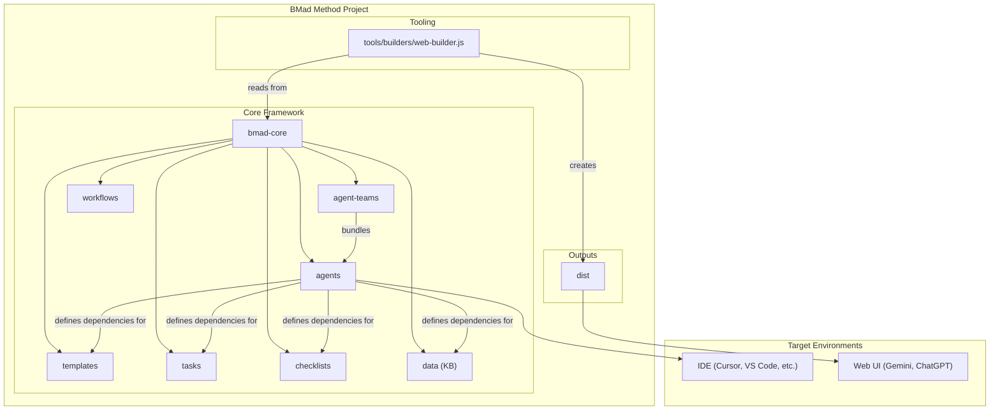
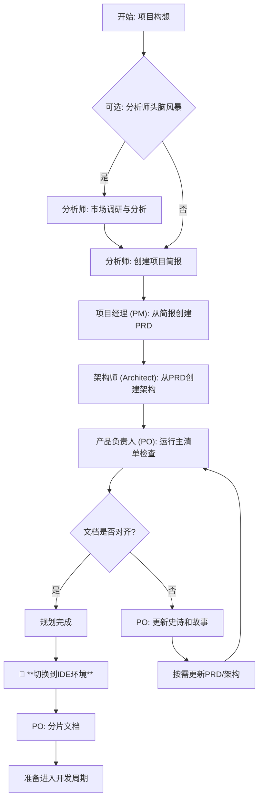
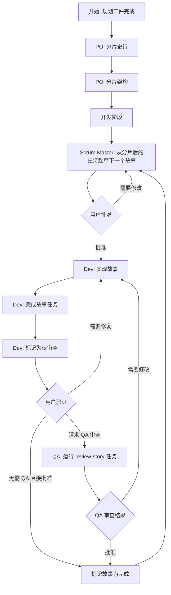

# BMad-Method: 核心代码与流程分析

## 一、项目概述

BMad-Method (Breakthrough Method of Agile AI-Driven Development) 是一个设计精密的通用 AI 代理（Agent）框架。其核心目标是解决当前 AI 辅助软件开发中普遍存在的两大痛点：

1.  **规划不一致性 (Planning Inconsistency)**：由 AI 生成的开发计划往往缺乏一致性和深度，导致后续执行困难。
2.  **上下文丢失 (Context Loss)**：在复杂任务的执行过程中，AI 代理常常会丢失关键的上下文信息，影响最终产出的质量。

为了解决这些问题，BMad-Method 提出并实现了一套名为 **“代理式敏捷开发” (Agentic Agile Development)** 的创新工作流。

此方法论的核心思想是，通过模拟一个高绩效的敏捷软件开发团队，让各司其职的 AI 代理（如产品经理、架构师、开发工程师、质量保证工程师等）在统一的框架和清晰的流程下协同工作。这不仅确保了从项目规划到代码实现的全程信息传递无损，还通过结构化的方式，让 AI 的能力得以在复杂项目中得到最大程度的发挥，最终交付出高质量、可预测的成果。

## 二、系统架构分析

BMad-Method 的架构围绕着一个核心理念构建：**将 AI 代理的行为和能力通过“配置即代码”的方式进行声明式定义，再通过工具链进行处理和打包，以适应不同的运行环境。**

整体架构可以分为三个主要部分：

1.  **核心框架 (Core Framework)**：位于 `bmad-core` 目录，是整个系统的“大脑”，定义了所有代理、团队、工作流和可复用资源。
2.  **处理工具 (Tooling)**：位于 `tools` 目录，是一系列 Node.js 脚本，负责解析、验证、打包核心框架中的定义。
3.  **交付产物 (Outputs)**：位于 `dist` 目录，是经过工具处理后的最终产物，主要用于在 Web UI 环境中运行。

### 2.1. 架构图

以下是官方文档中提供的架构图，清晰地展示了各个组件之间的关系：

### 2.2. 核心组件 (bmad-core)

`bmad-core` 目录是系统的核心，它不包含可执行代码，而是由一系列 Markdown 和 YAML 文件组成的声明式配置，共同定义了整个 AI 代理系统的行为和知识。

*   **`agents/`**:
    *   **作用**: 定义单个 AI 代理（Agent）的“基因”。每个 `.md` 文件代表一个代理，例如 `dev.md`（开发代理）或 `pm.md`（项目经理代理）。
    *   **结构**: 文件内部通过 YAML Front Matter 定义代理的元数据，如角色（role）、个性（persona），最关键的是其**依赖项（dependencies）**。依赖项精确声明了该代理能够使用的 `tasks`, `templates`, `checklists` 和 `data`，从而严格限定了其能力范围。

*   **`agent-teams/`**:
    *   **作用**: 将多个独立的代理捆绑成一个“团队”，以便在 Web UI 环境中作为一个整体被加载。
    *   **结构**: 使用 `.yaml` 文件定义团队构成。例如，`team-fullstack.yaml` 文件可能包含了前端、后端、QA、PM 等一系列代理，形成一个功能完备的全栈开发团队。

*   **`workflows/`**:
    *   **作用**: 定义特定场景下的高级工作流程。这些文件是指导用户和 `bmad-orchestrator`（编排代理）如何一步步完成复杂任务的“剧本”。
    *   **结构**: `.yaml` 文件描述了一个流程的各个阶段、每个阶段涉及的代理、产出的工件以及阶段转换的条件。例如，`greenfield-fullstack.yaml` 就定义了从零开始开发一个全栈应用的完整步骤。

*   **`tasks/`, `templates/`, `checklists/`, `data/`**:
    *   **作用**: 这些是可被代理们复用的“能力模块”。
    *   **`tasks/`**: 定义了执行具体、可重复动作的指令，如 `create-next-story`（创建下一个开发故事）。
    *   **`templates/`**: 提供标准化的文档模板，如PRD模板、架构文档模板。这些模板是“智能的”，内部可以包含提示词指令，引导 AI 完成内容的填充。
    *   **`checklists/`**: 为特定角色（如架构师）提供质量检查清单，确保产出物符合标准。
    *   **`data/`**: 包含核心知识库（`bmad-kb.md`）和技术偏好（`technical-preferences.md`）等关键数据，为所有代理提供一致的背景知识和行为准则。

### 2.3. 处理工具与交付产物

*   **`tools/`**:
    *   **作用**: 该目录包含一系列核心的 Node.js 脚本，是 BMad-Method 的“引擎室”，负责将 `bmad-core` 中声明式的定义转化为可用的产物。
    *   **关键脚本**:
        *   `cli.js`: BMad-Method 命令行工具的入口点，定义了如 `build`, `validate` 等命令。
        *   `builders/web-builder.js`: **这是最重要的构建脚本**。它负责解析代理和团队的定义，递归地查找并收集其所有依赖的资源（tasks, templates 等），最后将它们“压平”并捆绑成一个单一的 `.txt` 文件。
        *   `installer/installer.js`: 负责 `npx bmad-method install` 命令的逻辑，将框架安装到用户的项目中。
        *   `flattener/main.js`: 提供了将用户项目代码库“压平”成单个 XML 文件的能力，方便将整个项目作为上下文提供给 AI 进行分析。

*   **`dist/`**:
    *   **作用**: 构建输出目录，存放由 `web-builder.js` 生成的最终产物。
    *   **内容**: 主要包含两种 `.txt` 文件：
        *   **Agent Bundles** (e.g., `dist/agents/dev.txt`): 单个代理及其所有依赖的捆绑包。
        *   **Team Bundles** (e.g., `dist/teams/team-fullstack.txt`): 一个团队（包含多个代理）及其所有依赖的捆绑包。
    *   **用途**: 这些 `.txt` 文件被设计为可以直接上传到 Web UI AI 环境（如 Gemini），从而在单一上下文中激活整个团队或单个代理。

## 三、核心运行时流程

BMad-Method 的核心流程设计精妙，通过**环境分离**和**阶段性上下文传递**，完美解决了 AI 协作中的核心痛点。整个流程被划分为两个主要阶段，分别在不同的环境中进行。

### 3.1. 第一阶段：规划流程 (在 Web UI 中)

项目的启动和高层规划在一个支持大语言模型（LLM）的 Web UI 环境中（如 Gemini, ChatGPT, Claude 等）进行。这个阶段的目标是产出高质量、全局一致的规划文档。

**流程详解:**

1.  **加载上下文**: 用户选择一个合适的“团队捆绑包”（例如 `dist/teams/team-fullstack.txt`），并将其内容作为上下文提供给 Web UI 中的 AI。这相当于一次性“唤醒”了整个开发团队。
2.  **启动编排器**: 用户通过指令（如 `*bmad-orchestrator`）激活编排代理，该代理将根据预设的 `workflows` 文件引导用户进行后续操作。
3.  **协作规划**: 用户与规划型代理（`analyst`, `pm`, `architect`）进行多轮对话，通过头脑风暴、市场分析等任务，逐步创建出项目的核心规划文档，如：
    *   项目简报 (Project Brief)
    *   产品需求文档 (Product Requirements Document, PRD)
    *   架构设计文档 (Architecture Document)
4.  **质量校验**: 产品负责人（`po`）代理会对这些文档进行最终审核，确保它们之间的一致性和完整性。

**流程图:**

### 3.2. 第二阶段：开发周期 (在 IDE 中)

当规划文档准备就绪后，工作流将从 Web UI **切换到本地的集成开发环境 (IDE)**，如 VS Code, Cursor 等。这个阶段的目标是将宏伟的蓝图转化为具体的、可执行的代码。

**流程详解:**

1.  **环境切换与上下文准备**:
    *   用户将第一阶段产出的 PRD 和架构文档保存到项目的 `docs/` 目录中。
    *   产品负责人 (`po`) 代理执行 `shard-doc` 任务，将这些庞大的文档“分片”成一个个独立的、与特定史诗（Epic）或功能模块相关的上下文片段。**这是保证开发代理拥有精确、无干扰上下文的关键一步**。

2.  **迭代开发循环**:
    *   **创建故事**: Scrum Master (`sm`) 代理被激活，它会从分片后的文档中提取信息，创建一个极其详尽的、可供开发人员直接上手的“开发故事”（Story）。这个故事包含了所有必要的背景、需求、技术规格和实现细节。
    *   **用户审批**: 用户审核 SM 生成的故事，如果满意则批准。
    *   **实现代码**: 开发 (`dev`) 代理接收到这个被批准的故事，并基于其中丰富的上下文开始编写代码。由于上下文高度聚焦，`dev` 代理可以高质量地完成任务，而不会偏离方向。
    *   **质量保证**: 用户可以请求质量保证 (`qa`) 代理对 `dev` 代理生成的代码进行审查（`review-story` 任务）。`qa` 代理像一个资深开发者一样，提供重构建议、发现潜在问题，并确保代码质量。
    *   **完成与循环**: 一旦故事被标记为完成，SM 代理将再次启动，准备下一个故事，开发循环往复，直到项目完成。

**流程图:**

## 四、关键模块与代码分析

BMad-Method 的“代码”可以分为两个层面：一是作为系统核心的、声明式的“配置即代码”，二是驱动整个框架运行的、程序化的“工具链代码”。

### 4.1. “配置即代码”：代理与工作流的声明式定义

系统的真正核心业务逻辑，并非写在传统的程序代码中，而是体现在 `bmad-core` 目录下的 Markdown 和 YAML 文件里。这种方式使得代理的行为和业务流程极易被理解、修改和扩展。

#### 示例1：`architect` 代理的剖析 (`bmad-core/agents/architect.md`)

这个文件定义了“架构师”代理的一切。其关键在于文件头部的 YAML 块：

*   **`agent`**: 定义了代理的基本信息，如 `name: Winston`, `id: architect`, `title: Architect`。
*   **`persona`**: 详细描述了代理的性格、角色、风格和核心原则。这部分纯粹是给大语言模型的指令，用于角色扮演。
*   **`commands`**: 定义了用户可以对该代理使用的命令，如 `*create-full-stack-architecture`。这些命令通常会映射到一个或多个 `dependencies`。
*   **`dependencies`**: **这是代理能力的核心**。它声明了该代理被授权使用的所有“工具”，包括：
    *   `tasks`: `create-doc.md`, `document-project.md`...
    *   `templates`: `architecture-tmpl.yaml`, `fullstack-architecture-tmpl.yaml`...
    *   `checklists`: `architect-checklist.md`
    *   `data`: `technical-preferences.md`

通过这种方式，一个代理的能力边界被严格地限定了。`architect` 代理只能执行它被赋予的任务，使用它被授予的模板，遵循它被指定的清单。

#### 示例2：`greenfield-fullstack` 工作流的剖析 (`bmad-core/workflows/greenfield-fullstack.yaml`)

这个 YAML 文件定义了从零开发一个全栈应用的端到端“剧本”。

*   **`workflow.id`**: `greenfield-fullstack`，唯一标识。
*   **`workflow.description`**: 描述了这个工作流的用途。
*   **`sequence`**: **这是工作流的核心**。它是一个步骤的有序列表，每个步骤都定义了：
    *   `agent`: 执行该步骤的代理（如 `analyst`, `pm`, `architect`）。
    *   `creates` / `updates` / `validates`: 该步骤的主要产出物。
    *   `requires`: 执行该步骤所依赖的前置产出物。
    *   `condition`: 执行该步骤需要满足的条件（如 `user_wants_ai_generation`）。
    *   `notes`: 对该步骤的详细说明，也是给用户和编排代理的指引。
*   **`flow_diagram`**: 使用 Mermaid 语法绘制的流程图，提供了直观的可视化。

这个文件清晰地展示了代理之间的协作关系和依赖关系：`analyst` 先创建 `project-brief.md`，然后 `pm` 基于它创建 `prd.md`，再然后 `architect` 基于 `prd.md` 创建架构... 整个复杂的开发流程被精确地编排和固化下来。

### 4.2. “工具链代码”：驱动框架的 JavaScript 脚本

如果说 `bmad-core` 是大脑，那么 `tools/` 目录下的 JavaScript 脚本就是驱动这个大脑思考和行动的“神经系统”。这些脚本共同构成了一个强大的工具链，用于处理、验证和打包 `bmad-core` 中的声明式配置。

*   **`tools/cli.js`**:
    *   **角色**: 命令行接口（CLI）的入口。
    *   **功能**: 使用 `commander` 库构建，它定义了用户可以通过 `npx bmad-method <command>` 执行的所有顶层命令，如 `install`, `build`, `validate`, `flatten` 等。它负责解析用户输入的命令和参数，并调用相应的模块来执行具体任务。

*   **`tools/builders/web-builder.js`**:
    *   **角色**: **系统中最核心的构建脚本**。
    *   **功能**: 它的核心职责是创建 `dist/` 目录下的 `.txt` 捆绑包。其工作流程如下：
        1.  **解析目标**: 接收一个目标（如 `team-fullstack` 或 `agent:dev`）。
        2.  **依赖解析**: 递归地读取目标文件及其所有 `dependencies` 中引用的 `tasks`, `templates`, `data` 等文件。
        3.  **内容聚合**: 将所有解析到的文件的内容聚合在一起。
        4.  **生成捆绑包**: 将聚合后的内容写入一个单一的 `.txt` 文件，并在文件内部通过注释标明每个内容块的原始来源，以便于调试和理解。

*   **`tools/installer/installer.js`**:
    *   **角色**: `install` 命令的执行者。
    *   **功能**: 负责将 BMad-Method 的核心文件（`bmad-core`, `tools` 等）安装或更新到用户的项目中。它能够智能地处理新安装和升级，并在更新时为用户已修改的文件创建备份（`.bak`），避免覆盖用户的自定义配置。

*   **`tools/flattener/main.js`**:
    *   **角色**: `flatten` 命令的执行者。
    *   **功能**: 一个实用工具，用于将一个项目的完整代码库（智能地忽略 `.gitignore` 中指定的和默认的无关文件）“压平”成一个巨大的 XML 文件。这个 XML 文件可以被用作上下文，提供给大语言模型进行代码审查、架构分析或问答，是与 AI 协作的利器。
